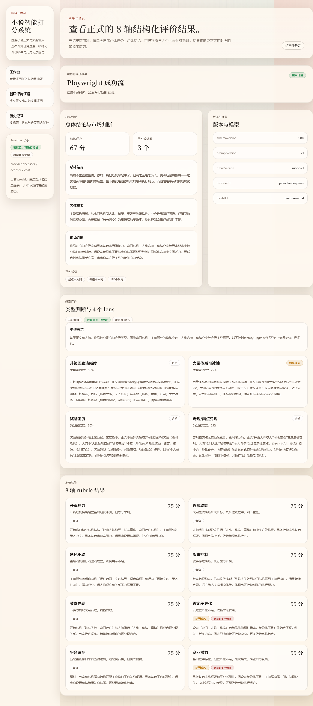

# 网络小说打分器

面向中文网文场景的本地单用户评测工具。当前正式结果固定为 `overall + axes + optional typeAssessment`，内部主线为 `input_screening -> type_classification -> rubric_evaluation -> type_lens_evaluation -> consistency_check -> aggregation -> final_projection`。



## 当前范围

- 官方运行口径：`Windows + PowerShell`
- 运行形态：`apps/api` 提供 API 并在进程内执行用户任务，`apps/web` 提供页面，`apps/worker` 只负责 `eval` / `batch`
- 代码真源：`apps/api/src/api/routes.py`、`packages/application/`、`packages/schemas/`、`packages/runtime/`、`packages/prompt-runtime/`、`packages/provider-adapters/`、`prompts/`、`evals/`
- 默认存储：`SQLite`，默认路径 `var/novel-evaluation.sqlite3`
- 上传格式：`TXT / MD / DOCX`
- Playwright 默认基线：deterministic provider；真实 `DeepSeek` 只作为可选验收路径

## 快速开始

前置依赖：`Python 3.13`、[`uv`](https://docs.astral.sh/uv/)、`Node.js 20+`、`pnpm`。

```powershell
.\scripts\setup.ps1
.\scripts\run-api.ps1
.\scripts\run-web.ps1
```

打开 `http://127.0.0.1:3000/`。默认可不配置 `NOVEL_EVAL_DEEPSEEK_API_KEY` 启动 API 和 Web，此时可以浏览历史与结果，但不能创建新任务。需要创建任务时，二选一：

1. 启动前通过 `.env` 或环境变量设置 `NOVEL_EVAL_DEEPSEEK_API_KEY`
2. API 启动时不带 key，然后在 `/tasks/new` 页录入一次性 runtime key

## 文档入口

- 使用者：[`docs/runbook.md`](docs/runbook.md)
- 维护者总览：[`docs/architecture.md`](docs/architecture.md)
- 契约说明：[`docs/contracts.md`](docs/contracts.md)
- Prompt 与评测：[`docs/prompts-and-evals.md`](docs/prompts-and-evals.md)
- 总导航：[`docs/README.md`](docs/README.md)

## 常用验证

```powershell
uv run --project apps/api pytest apps/api/tests evals/tests
pnpm --dir apps/web test
pnpm --dir apps/web build
pnpm --dir apps/web test:e2e
.\scripts\repo\check-hygiene.ps1
```

真实 DeepSeek E2E 为可选补充：

```powershell
$env:NOVEL_EVAL_DEEPSEEK_API_KEY = "<your-key>"
$env:NOVEL_EVAL_E2E_PROVIDER_MODE = "startup_key"
pnpm --dir apps/web test:e2e
$env:NOVEL_EVAL_E2E_PROVIDER_MODE = "runtime_key"
pnpm --dir apps/web test:e2e
```

## 非目标

- 生产部署、多租户、鉴权、SSE、WebSocket
- 跨语言契约代码生成
- 多 provider 生产级编排

## License / Contributing

本仓库按 [Apache License 2.0](LICENSE) 开源。提交改动前请先阅读 [CONTRIBUTING.md](CONTRIBUTING.md)。
