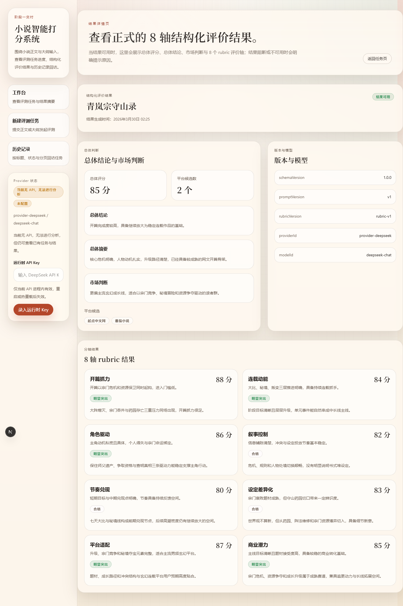

# 网络小说打分器

面向中文网文场景的本地单用户评测工具，用结构化流程输出签约概率、平台建议、编辑结论和详细分析。



## 当前范围

- 官方支持口径：`Windows + PowerShell` 本地部署
- 运行形态：`apps/api` 进程内执行用户任务，`apps/web` 提供界面，`apps/worker` 只负责 `eval / batch`
- 默认存储：`SQLite`，数据写入 `./var/novel-evaluation.sqlite3`
- 默认 Provider：未配置 `NOVEL_EVAL_DEEPSEEK_API_KEY` 时自动回退本地 deterministic adapter，方便零成本体验
- 当前上传格式：`TXT / MD / DOCX`

## 非目标

- 不是生产部署方案
- 不包含鉴权、多租户、WebSocket、SSE 或多 Provider 生产级切换
- 当前不把 Docker 作为官方主路径

## 5 分钟快速开始

首次运行只需要 `Python 3.13`、[`uv`](https://docs.astral.sh/uv/)、`Node.js 20+` 和 `pnpm`。

```powershell
.\scripts\setup.ps1
.\scripts\run-api.ps1
.\scripts\run-web.ps1
```

然后在浏览器打开：

- `http://127.0.0.1:3000/`
- `http://127.0.0.1:3000/tasks/new`

第一次体验不需要 API Key。直接提交一份正文和大纲即可完成本地 smoke，结果会由 deterministic fallback 生成，用来验证安装、页面流程和本地持久化是否正常。

如果你想改端口、数据库路径或日志目录，先复制一份配置模板：

```powershell
Copy-Item .env.example .env
```

详细步骤见 [快速开始](docs/getting-started/quick-start.md)。

## 启用真实 DeepSeek（可选）

如果你准备接入真实模型调用：

1. 复制 `.env.example` 为 `.env`
2. 填入 `NOVEL_EVAL_DEEPSEEK_API_KEY`
3. 重新启动 `.\scripts\run-api.ps1`

当你希望缺少 Key 时直接启动失败，而不是回退本地 adapter，可以额外设置：

```dotenv
NOVEL_EVAL_REQUIRE_REAL_PROVIDER=1
```

详细说明见 [真实 Provider 配置](docs/getting-started/real-provider.md)。

## 文档导航

使用者入口：

- [快速开始](docs/getting-started/quick-start.md)
- [真实 Provider 配置](docs/getting-started/real-provider.md)
- [常见问题](docs/getting-started/faq.md)

贡献与维护：

- [贡献指南](CONTRIBUTING.md)
- [本地 smoke 与维护者检查](docs/operations/local-installation-and-smoke.md)
- [运行配置与诊断](docs/operations/runtime-configuration-and-diagnostics.md)
- [质量门禁与回归](docs/operations/quality-gates-and-regression.md)

深度技术文档：

- [文档索引](docs/README.md)
- [系统概览](docs/architecture/system-overview.md)
- [运行与持久化模型](docs/architecture/runtime-execution-and-persistence.md)
- [Schema 真源索引](docs/contracts/canonical-schema-index.md)

## FAQ / Troubleshooting

- 想先验证项目能不能跑起来：直接用 fallback，不需要配置 `NOVEL_EVAL_DEEPSEEK_API_KEY`
- 页面访问不到 API：确认 `.\scripts\run-api.ps1` 正在运行，并检查 `.env` 里的 `NOVEL_EVAL_API_HOST / NOVEL_EVAL_API_PORT`
- 想清空本地数据：关闭 API 后删除 `./var/novel-evaluation.sqlite3`
- 想跑真实 Playwright E2E：先配置真实 `DeepSeek` Key，再执行 `pnpm --dir apps/web test:e2e`

更多问题见 [常见问题](docs/getting-started/faq.md)。

## License / Contributing

本仓库当前按 [Apache License 2.0](LICENSE) 开源，欢迎在提交 PR 前先阅读 [贡献指南](CONTRIBUTING.md)。
