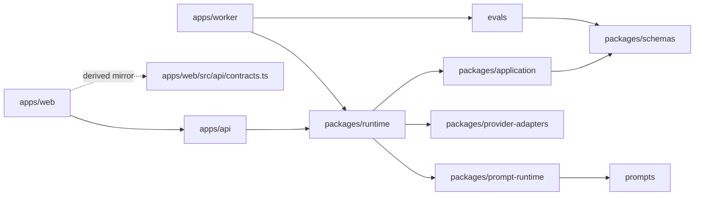

# Architecture

## 保留模块

| 模块 | 负责什么 | 怎么做 | 不负责什么 |
| --- | --- | --- | --- |
| `apps/api` | 对外 HTTP 边界、请求校验、任务入口 | `FastAPI` 路由调用 `packages/runtime` 装配出的 `EvaluationService` | 不持有 provider/runtime 装配细节，不定义 schema |
| `apps/web` | 本地 UI、轮询、结果展示、同源代理 | `Next.js App Router` + `TanStack Query` + `/app/api/*` 代理 API | 不直连 provider，不定义正式契约真源 |
| `apps/worker` | `eval` / `batch` CLI | 调用 `packages/runtime.worker` 取得共享 runtime，再跑 `evals` | 不承接用户页面任务 |
| `packages/runtime` | 运行时装配层 | 统一 provider 状态、prompt runtime、SQLite 仓储、日志和 API/worker bootstrap | 不实现业务评分规则 |
| `packages/application` | 用例编排与评分流水线 | `EvaluationService` 推进任务状态，`ScoringPipeline` 串联各阶段 | 不定义对外 HTTP，不定义 schema 真源 |
| `packages/schemas` | 全仓正式结构契约真源 | 统一 input / stage / output / evals Pydantic 模型与枚举 | 不做运行时装配 |
| `packages/prompt-runtime` | Prompt 选择与加载 | 从 `prompts/registry`、`prompts/versions`、`prompts/scoring` 解析正式资产 | 不定义 Prompt 正文 |
| `packages/provider-adapters` | Provider 执行边界 | 提供 `DeepSeek` 适配器和 deterministic 本地适配器 | 不定义任务状态和结果结构 |
| `prompts` | 正式 Prompt 资产 | `registry + versions + scoring markdown` 三层结构 | 不包含历史试验目录 |
| `evals` | 回归与批处理工件模型 | 数据集、suite、runner、report/baseline 写入 | 不承接用户主流程 |
| `scripts` | 启动、安装、仓库卫生检查 | `setup.ps1`、`run-api.ps1`、`run-web.ps1`、`repo/check-hygiene.ps1` | 不成为业务真源 |

## 依赖方向

约束：

- `apps/worker` 不再依赖 `apps/api` 的内部装配。
- `apps/api` 与 `apps/worker` 共用 `packages/runtime`。
- `apps/web/src/api/contracts.ts` 是前端消费镜像，不是正式真源。

## 端到端数据流

1. `apps/web` 通过同源 `/api/*` 或直接页面请求触发 API。
2. `apps/api/src/api/routes.py` 校验输入，创建任务，并把执行交给 `EvaluationService`。
3. `packages/runtime` 提供共享的 `SQLiteTaskRepository`、`RuntimePromptRuntime` 和 provider runtime。
4. `packages/application/services/evaluation_service.py` 负责任务状态推进、结果保存、失败/阻断落库、历史与 dashboard 读取。
5. `packages/application/scoring_pipeline/` 依次执行 `screening -> type_classification -> rubric -> type_lens -> consistency -> aggregation -> projection`。
6. `packages/prompt-runtime` 按 stage/scope 从 `prompts/` 解析 Prompt 元数据和正文。
7. `packages/provider-adapters` 执行真实 `DeepSeek` 或 deterministic adapter，并把返回值规整成统一 contract。
8. `packages/schemas` 验证每个阶段与最终结果；旧持久化结果在读取期只降级为 `not_available`，不影响历史任务可见语义。

## 评分主线拆分

- `input_screening`：判定输入组成、可评性、`full/degraded` 模式和阻断原因。
- `type_classification`：给出 Top-3 类型候选，并确定最终 `novelType` / `fallbackUsed`。
- `rubric_evaluation`：按 `requestedAxes` 分三批完成全部 8 轴。
- `type_lens_evaluation`：基于最终类型输出固定 4 个 lens。
- `consistency_check`：检查正文/大纲冲突、缺轴和无依据结论。
- `aggregation`：生成总体判断草稿、平台候选、市场判断、强弱项和整体置信度。
- `final_projection`：把 stage 结果投影成前端展示的 `overall + axes + optional typeAssessment`。

## 当前架构判断

- 对外稳定面只有 API 路由、任务状态语义、结果结构和页面路由。
- 运行时装配被收口到 `packages/runtime`，避免 app-to-app 反向依赖。
- 文档、Prompt 和 schema 已按“代码真源 + 少量解释文档”收敛，不再保留历史设计区。
